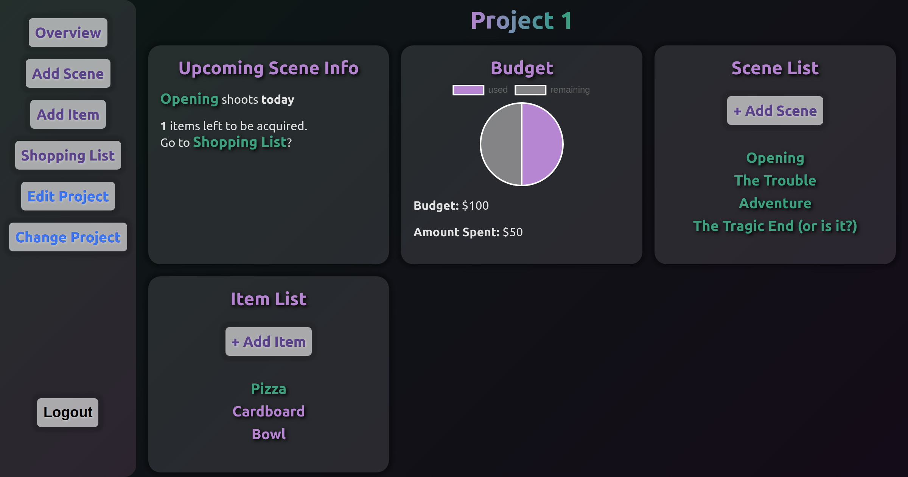

# Production Assistant API

**[Live Site](https://production-assistant.vercel.app/)**  
**[Frontend Repo](https://github.com/marcuses101/Production-Assistant-Frontend)**
**[Server](https://production-assistant-server.herokuapp.com)** 

## Summary

 

Used with the frontend Production Assistant Application, this REST API helps film producers keep their projects organized. Manage scenes, items, acquisitions. Keep track of the project's budget, status of the upcoming scene, and items left to acquire. 

## Endpoints